# Loom — Recursive Self-Improving Agent

[](https://github.com/lispmeister/loom/actions/workflows/ci.yml)
[](LICENSE)
[](https://clojurescript.org/)
[](https://docs.anthropic.com/)

Loom is a coding agent that rewrites its own source code. Written in pure ClojureScript, it spawns isolated experiments in disposable Apple containers, tests its modifications through a two-stage gate (automated tests + LLM code review), and promotes successful changes back to the main branch — autonomously improving itself generation by generation.

The core insight: ClojureScript is homoiconic (code is data), so the agent manipulates syntax trees, not text. Experiments run in VM-level isolation, so a bad generation is just a discarded container. Everything the agent can change — its loop, tools, prompts — is mutable. Everything it can't — the [Malli schemas](https://github.com/metosin/malli) that define the protocol — is a fixed point.

<p align="center">
  
</p>

## How It Works

Each generation follows the same cycle: **reflect → spawn → work → verify → promote or rollback → repeat**.

1. **Reflect** — Prime analyzes the codebase and proposes the next improvement
2. **Spawn** — Prime sends a `program.md` contract to the Supervisor, which creates an ephemeral Lab container
3. **Work** — The Lab agent autonomously implements the task, commits to a `lab/gen-N` branch
4. **Verify** — Prime independently checks: do tests pass? Does the diff look correct? (two-stage: tests + LLM review)
5. **Promote or rollback** — Success: merge to main, tag, clean up. Failure: discard the branch, destroy the container

This loop can run unattended. Prime reflects on what to improve next, and the cycle repeats.

## Architecture

Three components, all ClojureScript on Node.js:

- **Prime** — The live, known-good agent. Runs the agentic loop (Claude API → tool dispatch → repeat). Spawns Labs, verifies results, promotes or rolls back. Includes a `reflect` step that autonomously proposes the next improvement.
- **Supervisor** — Runs on the host (macOS). Manages container lifecycle: create, start, stop, destroy. Maintains generation history (`generations.edn`). Exposes HTTP dashboard.
- **Lab** — Ephemeral. Reads `program.md`, runs an autonomous agent loop with base tools only, commits results. Prime verifies independently before promoting. Labs cannot spawn other Labs or promote themselves.

```
Host (macOS 26, Apple Silicon)
├── Supervisor (ClojureScript/Node)
│   ├── HTTP dashboard (:8400)
│   ├── Container lifecycle (shells out to `container` CLI)
│   └── generations.edn (lineage tracking)
├── Prime Container
│   ├── Agent loop + Claude API client
│   ├── Tools: read-file, write-file, edit-file, bash, spawn_lab,
│   │         verify_generation, promote_generation, rollback_generation,
│   │         reflect_and_propose, run_autonomous_loop
│   └── HTTP dashboard + chat endpoint (:8401)
└── Lab Container (ephemeral)
    ├── Autonomous agent (reads program.md, implements task)
    ├── GET /status endpoint
    └── Commits to lab/gen-N branch
```

## LLM Usage

Both Prime and Lab are autonomous agents that call the Claude API (Anthropic). They share the same API client code (`agent/claude.cljs`) but run with different configurations:

| | Prime | Lab |
|---|---|---|
| **Default model** | `claude-sonnet-4-20250514` | `claude-haiku-4-5-20251001` |
| **Tools** | Full set + self-modification (spawn, verify, promote, rollback, reflect) | Base tools only (read, write, edit, bash) |
| **Interaction** | Multi-turn conversation, up to 20 messages in context | Autonomous — program.md in, committed code out |
| **Loop** | Tool-use loop, up to 40 iterations per turn | Same tool-use loop, same iteration cap |

The `agent/self_modify.cljs` module is excluded from the `lab-worker` build target — Labs have no access to spawn, promote, or rollback tools.

### Environment Variables

All configuration lives in `.env` (gitignored). Copy `env-template` to get started:

```bash
cp env-template .env
# Edit .env with your API keys
```

| Variable | Required | Default | Purpose |
|---|---|---|---|
| `ANTHROPIC_API_KEY` | Yes | — | API key for Prime (and Lab fallback) |
| `LOOM_MODEL` | No | `claude-sonnet-4-20250514` | Model for Prime agent |
| `LOOM_LAB_API_KEY` | No | Falls back to `ANTHROPIC_API_KEY` | Separate API key for Lab containers |
| `LOOM_LAB_API_BASE` | No | `https://api.anthropic.com` | Base URL for Lab API (Anthropic-compatible) |
| `LOOM_LAB_MODEL` | No | Falls back to `LOOM_MODEL` | Model override for Lab containers |
| `LOOM_LAB_TIMEOUT_MS` | No | `300000` (5 min) | Max Lab generation runtime (Supervisor hard-kill + Prime polling) |
| `LOOM_MAX_ITERATIONS` | No | `40` | Max tool-use loop iterations per turn (forwarded to Labs) |
| `LOOM_MAX_GENERATIONS` | No | `5` | Max generations for autonomous loop (0=unlimited) |
| `LOOM_TOKEN_BUDGET` | No | `0` (unlimited) | Max cumulative tokens for autonomous loop |
| `LOOM_PLATEAU_WINDOW` | No | `3` | Stop after N promoted gens without fitness improvement |
| `LOOM_REPO_PATH` | No | `.` | Repo path managed by the Supervisor |
| `LOOM_NETWORK` | No | `loom-net` | Container network name |

**Model precedence:**

- **Prime** reads `LOOM_MODEL` → falls back to `claude-sonnet-4-20250514`
- **Lab** receives `LOOM_LAB_MODEL` if set, otherwise `LOOM_MODEL`, otherwise uses its built-in default (`claude-haiku-4-5-20251001`)

```bash
# Default behavior: Sonnet for Prime, Haiku for Lab
set -a && source .env && set +a
npm run supervisor

# Use Sonnet for both Prime and Lab
LOOM_MODEL=claude-sonnet-4-20250514 npm run supervisor

# Sonnet for Prime, specific model for Lab
LOOM_LAB_MODEL=claude-haiku-4-5-20251001 npm run supervisor
```

## Tech Stack

| Component | Technology |
|---|---|
| Language | ClojureScript (self-hosted via `cljs.js`) |
| Runtime | Node.js (no JVM) |
| Schemas | [Malli](https://github.com/metosin/malli) — data-driven, schemas as EDN |
| Containers | [Apple Containerization](https://github.com/apple/container) — VM-per-container |
| LLM | Claude API (Anthropic) — single provider for v0 |
| HTTP | Node.js `http` module — no frameworks |
| Task tracking | [beads](https://github.com/lispmeister/beads) |

## Project Structure

```
src/
  loom/
    shared/        — Malli schemas, eval protocol, HTTP helpers
    agent/         — Agentic loop, Claude API client, tools, self-modify,
                     reflect step, autonomous loop driver, CLI
    supervisor/    — Container lifecycle, version management, fitness scoring,
                     generation reports, dashboard
    lab/           — Eval server + autonomous worker (tool-call tracking)
test/
  loom/            — Tests (236 tests, 607 assertions)
architecture-reviews/  — Periodic system reviews
```

## Key Design Decisions

1. **Self-hosted ClojureScript.** AOT-compiled by shadow-cljs for startup, but Labs use `cljs.js/eval-str` at runtime to evaluate modified code without a build step. This is what enables the agent to test its own modifications.

2. **Containers as the keep/revert boundary.** Safety comes from VM-level isolation, not the language. Promote = merge to main + tag. Revert = destroy container + discard branch.

3. **Malli contracts as fixed points.** The communication schemas are the one thing the agent cannot modify. Everything else — loop, tools, prompts — is mutable.

4. **Two-stage verification.** Every generation passes automated tests AND an LLM code review before promotion. Both gates must pass.

5. **Radical minimalism.** No MCP, no sub-agents, no streaming, no frameworks. Direct Claude API calls over plain HTTP.

## HTTP Endpoints

**Supervisor (:8400)**
- `GET /` — Dashboard (generation history, status)
- `GET /logs` — SSE event stream
- `GET /stats` — JSON stats
- `POST /spawn` — Create Lab container with program.md
- `POST /promote` — Merge lab branch, tag, cleanup
- `POST /rollback` — Discard lab branch, cleanup

**Prime (:8401)**
- `GET /` — Dashboard
- `GET /logs` — SSE event stream
- `GET /stats` — JSON stats
- `POST /chat` — User message input, SSE response

**Lab (:8402)**
- `GET /status` — `{status, progress, error}`

## Malli Schemas (Contracts)

The eval protocol schemas are the fixed points. The agent cannot modify these.

```clojure
;; Eval protocol: Prime ↔ Lab eval server
(def EvalRequest
  [:map
   [:form :string]
   [:timeout {:optional true} :int]])

(def EvalResponse
  [:map
   [:status [:enum :ok :error]]
   [:value {:optional true} :any]
   [:message {:optional true} :string]])
```

The self-modification cycle uses direct HTTP JSON payloads (`POST /spawn`, `/promote`, `/rollback`) — see PLAN.md for details.

## Prerequisites

- macOS 26+ on Apple Silicon
- Node.js 25+
- Clojure CLI (`clj`)
- shadow-cljs (`npm install -g shadow-cljs`)
- Apple Containerization (`container` CLI — install from https://github.com/apple/container/releases)

## Getting Started

```bash
# Install dependencies
npm install

# Copy env template and add your API key
cp env-template .env
# Edit .env with your ANTHROPIC_API_KEY

# Run tests
npm test && node out/test.js

# Start Apple container system
container system start

# Start the supervisor (host-side, source .env first)
set -a && source .env && set +a
npm run supervisor

# The supervisor creates and manages Prime/Lab containers automatically
```

### CLI Tools

Individual agent tools can be run directly without starting the HTTP server:

```bash
# Reflect: analyze history and propose next improvement
node out/agent.js reflect

# Spawn a Lab with a program.md
node out/agent.js spawn path/to/program.md

# Run the autonomous loop (reflect → spawn → verify → promote/rollback)
node out/agent.js autonomous
```

## Development

- VS Code + [Calva](https://calva.io/) for REPL-connected editing
- Watch mode: `npm run watch:test` for continuous test compilation
- Task tracking: `bd ready` to see available work, `bd list` for all issues

## References

### Blog Posts

- [It Rewrote Itself: Loom's First Autonomous Self-Modification](https://lispmeister.github.io/deeprecursion/posts/2026-03-17-it-rewrote-itself.html) — Gen-72 autonomously modified its own source and promoted to master in 56 seconds
- [The Prime and the Lab](https://lispmeister.github.io/deeprecursion/posts/2026-03-12-recursive-self-improvement.html) — Architecture spec: why three components, why ClojureScript, why containers
- [The program.md Protocol](https://lispmeister.github.io/deeprecursion/posts/2026-03-13-program-md.html) — The contract that steers each generation

### Inspiration

- [Pi Coding Agent](https://mariozechner.at/posts/2025-11-30-pi-coding-agent/) — Minimalist agent design
- [Build Your First 24/7 Agentic Loop](https://wezzard.com/post/2025/09/build-your-first-agentic-loop-9d22) — Contract-driven loops

### Libraries & Tools

- [Malli](https://github.com/metosin/malli) — Schema library
- [Apple Containerization](https://github.com/apple/container) — Container runtime
- [ClojureScript Self-Hosting](https://clojurescript.org/guides/self-hosting) — `cljs.js` docs
- [beads](https://github.com/lispmeister/beads) — Issue tracking

## License

[MIT](LICENSE) — see [LICENSE](LICENSE) for details.
