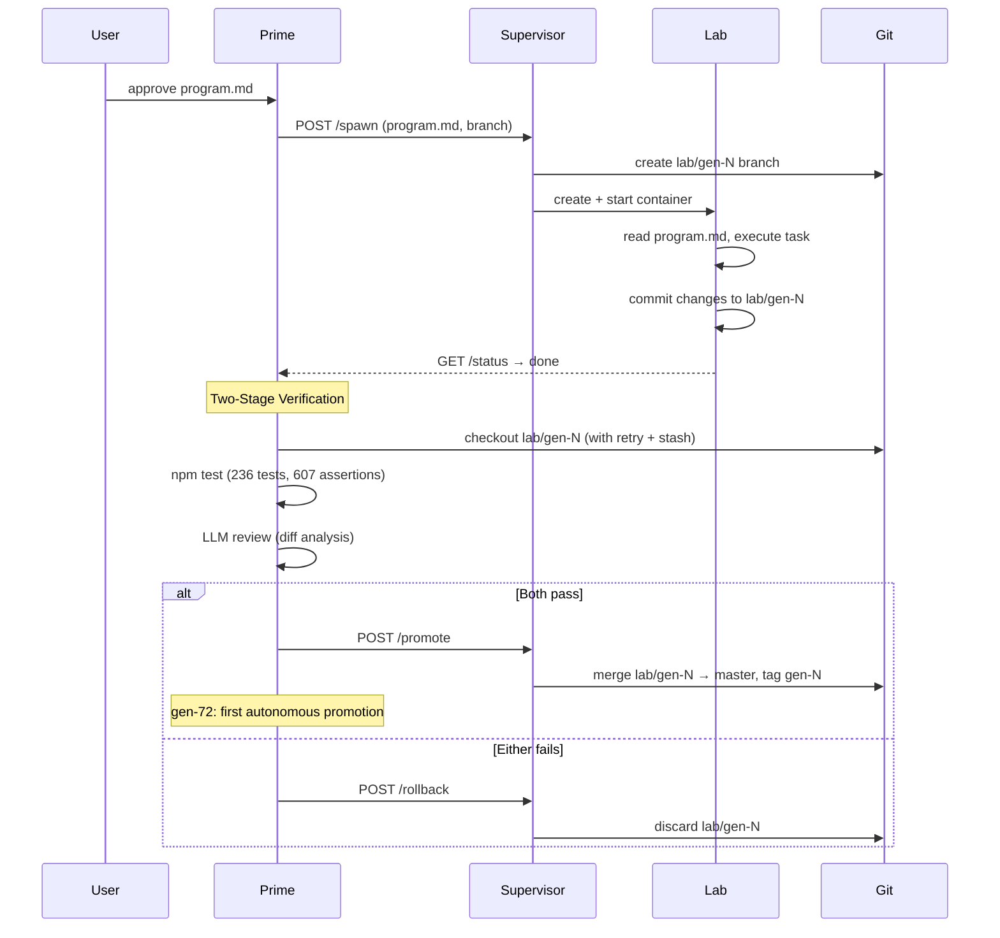

# Architecture Review — 2026-03-17-002

**Reviewer:** Claude Opus 4.6
**Scope:** Post-success analysis — first autonomous promotion (gen-72), pipeline validation across 3 models, project status assessment
**Codebase:** 26 source files (~13,500 LOC), 21 test files, 236 tests (607 assertions), 0 failures

---

## Context

Gen-72 marks the first autonomous code modification promoted to master. An Opus 4.6 Lab modified `self_modify.cljs` (changed 2 private functions to public) and created a 63-line test file with 18 assertions — verified by two-stage verification (tests + LLM review) and promoted without human intervention. This review assesses where the project stands after 17 autonomous generations across 3 LLM providers.

---

## What's Proven

The full autonomous self-improvement pipeline works end-to-end:

```
reflect → write program.md → spawn Lab → execute → verify (tests + LLM review) → promote → repeat
```

- **gen-72** (Opus 4.6) is the first autonomous code modification promoted to master
- The Lab modified its own source (`self_modify.cljs`) and added tests — not just file creation
- Two-stage verification caught bad generations correctly (Haiku gen-58: tests passed, LLM rejected)
- Pipeline survived 17 generations across 3 providers without manual intervention

---

## By the Numbers

| Metric | Value |
|--------|-------|
| Source files | 26 (13,503 LOC) |
| Test files | 21 |
| Tests / Assertions | 236 / 607 |
| Generations attempted | 72 (17 autonomous) |
| Generations promoted | 4 (gen-1 manual, gen-42/43 semi-manual, gen-72 autonomous) |
| Beads closed | 131 of 144 |
| Open issues | 13 (0 blocked) |

---

## Autonomous Run Results

| Run | Model | Generations | Promoted | Key Finding |
|-----|-------|-------------|----------|-------------|
| 1 | Haiku | 5 (gen-43–47) | 0 | Discovered branch fetch race, local changes blocking checkout |
| 2 | Haiku | 5 (gen-53–58) | 0 | gen-58 tests passed but LLM reviewer too strict |
| 3 | Anthropic | 3 (gen-59–61) | 0 | API credits exhausted (grant propagation delay) |
| 4 | Minimax M2.5 | 3 (gen-65–68) | 0 | M2.5 read-only behavior — reads files but never writes |
| 5 | Opus 4.6 | 1 (gen-72) | 1 | Clean success in 56s, first agent code modification |

**Total: 17 autonomous generations, 1 promoted.** Each failed run exposed real infrastructure bugs that were fixed before the next attempt.

---

## What's Working Well

1. **Infrastructure is battle-tested** — 6 bugs found and fixed through real autonomous runs, not hypothetical testing
2. **Two-stage verification** — catches both test failures AND semantic issues (too-strict reviewer was the only false negative, now fixed)
3. **Multi-provider support** — seamless switching between Anthropic and Minimax via `.env`
4. **CLI workflow** — `node out/agent.js spawn/verify/promote` eliminates friction
5. **Cost management** — `scripts/check-credits.sh` prevents wasted runs

---

## What's Not Working

1. **Haiku can't do it** — gets close but produces code that fails verification. Too imprecise for ClojureScript self-modification.
2. **Minimax M2.5 is read-only** — a model-level issue, not fixable from our side. All 3 generations produced only program.md, no code changes.
3. **Only Opus succeeds** — at $1-2/gen, sustained autonomous runs are expensive (~$5-10 for 5 generations).

---

## Infrastructure Bugs Fixed During Autonomous Runs

| # | Bug | Impact | Fix |
|---|-----|--------|-----|
| 1 | Branch fetch race condition | Verify fails with "pathspec did not match" | Retry loop (3 attempts, 2s delay) in `checkout-and-test` |
| 2 | Local changes blocking checkout | `git checkout lab/gen-N` rejected | `git stash --include-untracked` before checkout, `git stash pop` after |
| 3 | .gitignore duplication | Entries appended on every spawn | Regex check before appending |
| 4 | program.md gitignored | `git commit` fails with "nothing to commit" | Removed program.md from .gitignore (tracked in branch history) |
| 5 | LLM reviewer too strict | Valid changes rejected (Lab environment artifacts) | Updated review prompt to ignore .gitignore diffs, container paths |
| 6 | Timeout handler missing branch fetch | Timed-out generations can't be verified | Added fetch in both `on-lab-done` (all outcomes) and `on-timeout` |

---

## Cost Analysis

| Model | Cost/Generation | Success Rate | Cost/Success |
|-------|----------------|--------------|--------------|
| Haiku | ~$0.10 | 0/10 | ∞ |
| Minimax M2.5 | ~$0.05 (coding plan) | 0/3 | ∞ |
| Opus 4.6 | ~$1-2 | 1/1 | ~$1-2 |

Observed: Sonnet costs ~$0.50/gen for Prime reflect + review overhead. The `scripts/check-credits.sh` script validates API credits and estimates run costs before committing to expensive operations.

---

## Open Work (by priority)

| Priority | Issue | What | Why it matters |
|----------|-------|------|----------------|
| P1 | loom-dl2 | Close the recursive loop (epic) | The top-level goal — fully autonomous reflect→spawn→verify→promote |
| P1 | loom-dl2.12 | Autonomous loop driver (sub-epic) | End-to-end autonomous run without human intervention |
| P2 | loom-cjp.2/3 | Switch to Claude Code token | Eliminates separate API key, consolidates billing |
| P2 | loom-ajq | Rate limit mitigation | Needed for sustained autonomous runs |
| P3 | loom-0as | Fitness gaming risk | Test-count incentive could lead to trivial test inflation |
| P3 | loom-63m | Babashka task runner | Dev convenience (deferred) |
| P4 | loom-tku | Parallel Labs | Tree search over generations (future) |

---

## Strategic Assessment

The pipeline works. The bottleneck is now **cost** (Opus) and **task selection** (what's safe enough to run autonomously but valuable enough to matter), not infrastructure.

### Next High-Value Autonomous Tasks

Gen-72 was carefully chosen (pure helper tests, low risk). To build confidence, the next steps could be:

1. **More test coverage tasks** — safe, additive, measurable via fitness function. Each success directly increases the assertion count metric.
2. **Small refactors** — extract helpers, rename internals. Tests catch regressions, low blast radius.
3. **Feature additions** — new tools, new CLI commands. Higher risk, higher value. Requires more precise program.md specs.

### Model Strategy

- **Haiku for prototyping** — cheap enough to iterate on program.md design, even if generations don't promote
- **Opus for production** — expensive but reliable. Use for tasks that matter.
- **Sonnet stays as Prime** — good balance for reflect + review overhead

### Key Risk: Fitness Gaming (loom-0as)

The current fitness function rewards test count: `score = (tests-run * 10) + assertions - (tokens / 1000)`. An autonomous agent optimizing this could add trivial tests (`(is (= 1 1))`) to inflate scores without improving the codebase. Mitigations to consider:
- LLM review already catches egregious cases
- Could add a "test quality" dimension to the review prompt
- Could cap score-from-tests growth per generation

---

## Sequence Diagram: Autonomous Pipeline (Validated)



---

*Review date: 2026-03-17T19:30:00Z*
*Previous review: review-2026-03-17-001 (pre-autonomous-run system review)*
